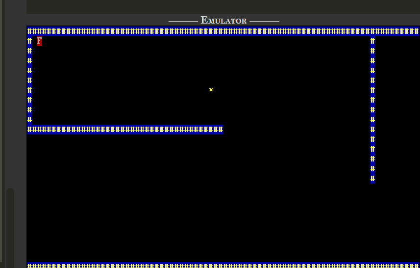

# Assembly-Maze-Game
# 🧩 Maze Solver Game (x86 Assembly)

A maze navigation game built entirely in **16-bit x86 Assembly Language** for DOS. The player must navigate through the maze, avoid obstacles, and reach the finish point using keyboard controls.

Developed as part of a Systems Programming project to explore low-level programming concepts including memory management, BIOS interrupts, direct video memory access, and collision detection.

---

## 🎮 Gameplay

The player starts at a predefined location and must reach the goal tile while avoiding walls.

### Controls

| Key | Action |
|------|--------|
| ↑ | Move Up |
| ↓ | Move Down |
| ← | Move Left |
| → | Move Right |
| ESC | Exit Game |

---

## ✨ Features

- Built completely in x86 Assembly
- Direct video memory rendering using `0xB800`
- Real-time keyboard input through BIOS interrupts
- Collision detection system
- Goal detection and win screen
- DOSBox compatible
- Lightweight `.COM` executable

---

## 🛠 Technologies Used

- x86 Assembly Language
- NASM Assembler
- DOS / DOSBox
- BIOS Interrupts
- Memory-Mapped Video I/O

---

## 📂 Project Structure

```text
maze-solver-game/
│
├── src/
│   └── maze.asm
│
├── screenshots/
│   └── gameplay.png
│
├── docs/
│   └── architecture.pdf
│
├── build/
│   └── maze.com
│
└── README.md
```

---

## 🧠 Key Concepts Implemented

### Direct Video Memory Access

Instead of using graphics libraries, the game renders directly to the DOS text-mode video buffer located at:

```asm
0xB800
```

This provides full control over screen rendering and improves performance.

### Collision Detection

Before moving the player, the game checks the next position to determine whether it contains a wall tile.

### BIOS Keyboard Handling

Keyboard input is captured using BIOS interrupt services:

```asm
INT 16h
```

allowing responsive movement controls.

---

## 🚀 How to Build

### Assemble

```bash
nasm -f bin src/maze.asm -o build/maze.com
```

### Run with DOSBox

```bash
dosbox build/maze.com
```

---

## 📸 Screenshots

Add gameplay screenshots here.

### Main Game Screen



---

## 🎯 Learning Outcomes

Through this project I gained practical experience in:

- Assembly Language Programming
- Low-Level Memory Management
- DOS Architecture
- BIOS Interrupt Programming
- Game Logic Development
- Collision Detection Algorithms

---

## 🔮 Future Improvements

- Multiple Levels
- Timer System
- Sound Effects
- Enemy AI
- Advanced Maze Generation
- Score Tracking

---

## 👨‍💻 Author

**Sohaib Irshad**

Computer Science Student  
FAST-NUCES Lahore

GitHub: https://github.com/Sohaib-Irshad

---

## 📄 License

This project is shared for educational and learning purposes.
